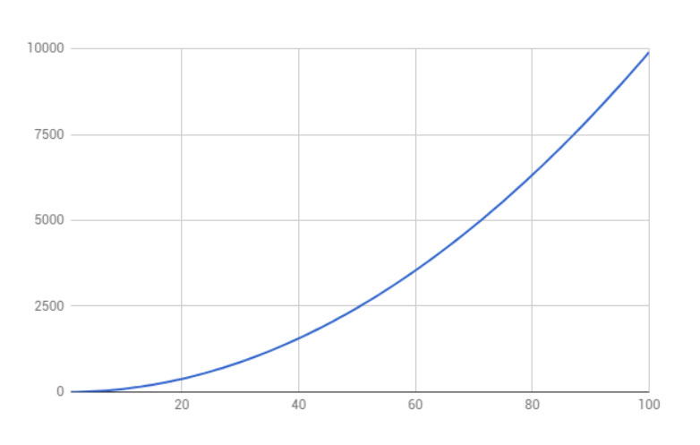

# Steps to Developing a SaaS

## SaaS Application Development Steps For MVP

These are steps for the SaaS application build, not the public facing website. **Several of these items are run in parallel, but noted linearly in the list below.**

1. Planning \(also referred to as “scoping”\)
   * Information Architecture \(IA\) development
   * Determine technologies to be used
   * SaaS development costs
   * SaaS development team 
2. Wireframing & experience design
   * What is UX in SaaS
   * When a SaaS isn’t easy to use
   * SaaS design case study
   * Flows, processes, and planning
     1. A SaaS UX designer should help you...
   * Concept design 
3. Platform setup
   * Repo setup
   * Development environment and dependencies setup
   * Remote development environments setup
   * Hosting environment setup 
4. SaaS application development
   * Frontend development
   * Backend development 
5. Alpha testing
   * User testing 
6. Content review
7. Beta testing
   * User testing 
8. SaaS release candidate review
9. Release
10. Continuous Integration

### 

