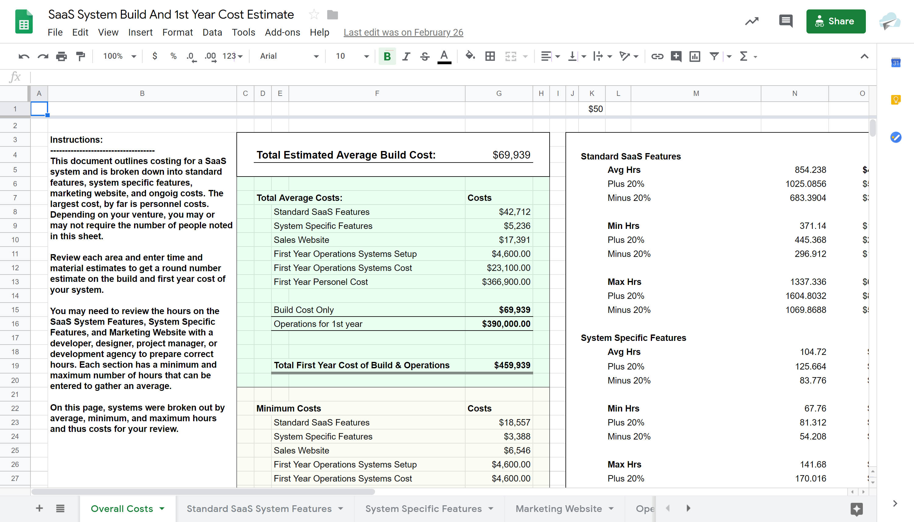
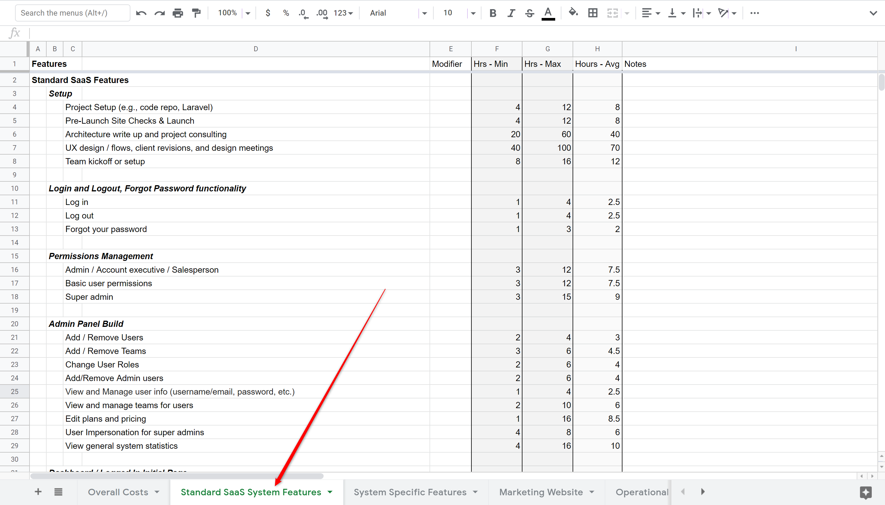
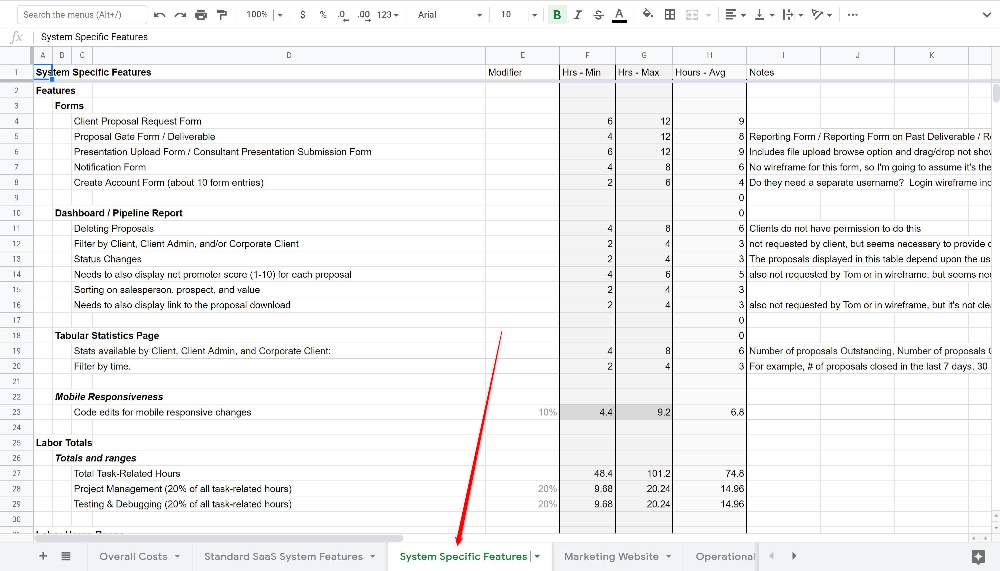

# Costing Your System

## Breaking Down the Costing Process

Costing is far from simple. Personally, I feel like it is the most tedious part of the entire project, but also the most important. Properly costing your build process will prove essential in mapping out the project and then keeping it on time and on budget.

There are countless examples of projects going sideways and issues popping up due to a lack of planning in this book, and across the business environment. I would guess that outside of a lack of validation, a lack of understanding in planning is the number one reason for the failure of SaaS businesses. Small changes in the system infrastructure can lead to huge changes in cost down the road and this can often be discovered during the system costing process.

There are four phases to costing your project:

1. Estimate
2. Information Architecture & Flows
3. Operation Costs
4. Working Numbers

We'll review each step briefly here, but there will also be a more thorough breakdown below.

### Estimate

Your estimation is, essentially, going to serve as a rough draft of your scope of work. That means you're looking in-depth at estimates for multiple areas of work then estimating minimum and maximum times for each.

Even with a substantial amount of time put towards your estimation, it is still just that, an estimate. It's not final, and it's certainly not exact, but it should give a firm idea of what the project _may_ cost. The more work you put towards you estimate process, the less time your actual scope of work will be to write out and the less time it will take to do plan the rest of your project build.

### Information Architecture & Flows

Your estimate will then be fleshed out further into a full Information Architecture \(IA\). If you're not familiar with project scoping, you may want to take a look at [this comprehensive guide to scoping at BrainLeaf](https://brainleaf.com/learn-project-scoping).

Paired together, you information architecture and flows will serve as the primary planning documents for the project, much like a set of blueprints acts as the primary planning document for a construction project. These documents keep everybody, at all levels of the project, on the same page and pre-empt issues.

#### The Information Architecture

The Information Architecture \(IA\) is a written document that describes each page, feature, view, state, and functionality of the system. As you are writing this document, I recommend to describe the features by structure as well as to note the functionality of each area. Every element and it's functionality envisioned on every view should be described insofar as what components make it up as well as how it works. In the best case scenario, this document will also describe every page, every view, every element, every function, and the purposes of all these things within the system. The more time you take to plan this aspect of your project, the faster and smoother the rest of the project will go.

#### Flows

The flows are page by page designs that incorporate the elements noted in the information architecture. As you can imagine, it is substantially easier for a designer to start working with a complete information architecture than to start from scratch on any complex SaaS project. With a fully described system, a designer can plan their design processes or a team can plan resource utilization.

The flows are also very important because while an architect may plan a particular feature or system into a page, the flow and user experience for the ideated system may not actually come together as envisioned. So having a viewable, even if basic, design is critical to a well-planned system.

### Operational Costs

It is important to remember throughout the planning phase that you are not just building a website or a SaaS tool - you're also building a _business_. You have to begin planning for not only the creation and utilization of the tool, but also for continued operation of the tool, implementation of new features, and support for your customers. You'll have staff that needs to be paid, overhead to track, advertising to purchase, taxes to pay, and much more.

And if you don't begin calculating these costs now, they'll catch you off guard later, and you'll potentially have under-priced your services, leaving you scrambling to make up the difference after launch.

### Working Numbers

Once your information architecture, flows, and operational cost planning is finalized, then you will have a great starting point to understand the true costs of the system and be able to make a determination as to the success of the system. Please also remember that the total you come up with here still isn't quite "final". These working numbers might still fluctuate a bit over the course of the project. 

### The Cost of Costing

As you prepare to cost your system, you may need to have some idea as to how much it costs to do this. Generally, you can expect to spend somewhere in the range of 1.5k to 20k to cost out the entire system. Even if you're doing this yourself, the cost is going to be substantial. When we I work to do this kind of project, the overall cost of using my team usually comes in at ranges like this:

| Size of Project | Cost Range to Plan |
| :--- | :--- |
| $35,000 - $50,000 | $3,000 - $5,000 |
| $50,000 - $100,000 | $4,000 - $10,000 |
| $100,000 - $250,000 | $8,000 - $25,000 |
| $250,000 - $500,000 | $20,000 - $50,000 |
| $500,000 - $1,000,000 | $35,000 - $120,000 |

As the size of the project goes up, the costing range becomes harder to predict. It is possible that even a very large project could be easy to plan, but for the most part as project builds go up the complexity of planning goes up quadratically. 

## The Estimate

This book comes with a template to get you started in your planning process. 

[Get started with the SaaS planning spreadsheet.](https://docs.google.com/spreadsheets/d/1qC2h5e_YFvCAAoWA4Vaj1U7k7XPjsUMuqVoLKLAZh0I/edit?usp=sharing)

_Start off by making a copy of this spreadsheet for your project and putting it into your Google Drive account._

#### Who should work on this?

The following team members should review this document together before proceeding.

* The Information Architect
* Lead Developer
* Lead Designer
* Lead Stakeholder

### Spreadsheet organization

The spreadsheet is broken into five sections:

* Overall Costs
* Standard SaaS System Features
* System-Specific Features
* Marketing Website
* Operational Costs

The Overall Costs worksheet is a dashboard that shows sums from all other areas in one, centralized place. 

With the exception of the overall costs page, each worksheet has a list of items, modifier column that is used to add a modifying value to the other hours, a minimum, maximum, average, and notes column. 

For each list item, a minimum and maximum number of hours are applied and any modifiers are added to those times. The notes column is used to describe the functionality of each item. The hours average has a formula that takes the min hours plus the max hours and divides by two, giving the average number of hours. At the bottom of the page, there is a total number of hours, then a plus and minus 20% amount. 

In development, hours can be vastly different based on small changes to scope of work. So a min/max hours amount is very helpful. Take a look at 

### Pricing Standard SaaS Features

Click on the second worksheet in the spreadsheet entitled "Standard SaaS System Features"

E

The first element of our project estimation focuses on is a listing of “standard features”. In this area, we start off with the general systems that most SaaS systems need. 


**IMPORTANT NOTE:** The item entitled "UX deisgn / flows, client revisions, & design meetings can balloon quickly! This item must be planned by a professional designer. It can easily go from 40 hours to 400 hours, so do NOT underestimate this item!


Your MVP may or may not require a full list of features often included in a standard SaaS. So review  this worksheet and determine what features can be removed first.

Remember as you proceed through this worksheet that this area covers items that almost all SaaS systems has, but probably none of the system-specific features from your SaaS. That will be covered on the next page.

### System-Specific Features

Now that you have removed anything not necessary from the general SaaS features, move on to the System-Specific Features.

#### Breaking down the estimate by major features

This worksheet is where you will put the majority of your time for the estimate. In this worksheet, consider the major features, outside of standard SaaS features, that your system contains. In this area, create a header for each major area and then name and describe each major feature.

The goal here is to get an hours range for each major area, not to have a a complete breakdown of every item. 

## How to Create an Estimate

Creating your initial estimate isn't going to be easy. There are a lot of considerations, as the list above should have highlighted. We're going to go a bit more into that now, though.

### The Estimation Labyrinth

The secret of creating a good estimate is experience. If you're drafting an estimate for the first time, you're going to make mistakes. The process is very similar to navigating a labyrinth - the twists and turns are confusing, there are issues that seemingly arise out of nowhere like roaming minotaurs, and you may end up with a monstrous estimation gap - a Goblin King you were unprepared to deal with.

However, these issues can all be dealt with. You may not have the experience or the knowledge, but others have trekked this path before you, and we can show you where the pitfalls are, how to avoid the frightening problems that might otherwise surprise you, how to deal with a huge gap, and pretty much anything else. 

Don't forget to utilize your resources. Do your research.

### An Example of An Estimate-Creation Process

The below article delves into the process that I have developed with my team for creating accurate estimates. These estimates then expand into our project scope with relative ease. Check out the article for more information. Below that is a link to the spreadsheet we use, which has numbers already put in as an example for your use.



#### Example Spreadsheet:

[The example spreadsheet can be seen here with potential costs for your system.](https://docs.google.com/spreadsheets/d/1qC2h5e_YFvCAAoWA4Vaj1U7k7XPjsUMuqVoLKLAZh0I/edit?usp=sharing)

### Formula for cost to build based on features & complexity

Here, we'll expand upon the initial list from earlier, and we'll refer a bit to the numbers mentioned in the spreadsheet linked just above. 

As you know, SaaS tools and platforms range in size, complexity, reach, and much, much more. So the range of time vary tremendously.

#### MVP Release:

The items below have been done for you in the attached spreadsheet. Within the spreadsheet you have:

1. A list of ‘standard’ features that are considered to be a part of most SaaS systems.
2. A list of ‘core’ features of your system which are outside the functionality of standard SaaS features.
3. Standard costs for a marketing website
4. Operational costs including software, personnel, and miscellaneous business items.   

All of these items come together on the main page of the spreadsheet to allow you to see the total costs and play around with costs.

#### Standard SaaS features include things such as:

* Promotional website
* User login/logout
* User management - where user can manage their information
* Admin panel
* Dashboard or initially logged in area

#### Marketing Website - This area includes items such as:

* Home page
* Tour
* Features
* Pricing
* Blog
* Company
* Legal pages
* Signup or get started page

#### Operational costs including:

* Project management software
* Company emails
* Password management systems
* Chatbot software
* Marketing systems
* Advertising spend
* Business setup and miscellaneous items
* Personnel 

### Presenting the Estimate

Once you have the estimate finalized, it's time to present. You'll need to sit down with your client - whether in person or on a conference call is up to preference - and review each of the line items in detail, giving the client a chance to ask questions about each one, ensuring they fully understand the details of the venture they're about to agree to.

It is entirely possible that they back out after seeing the estimate. If that's the case, then don't try to push them on the issue - you don't want a client who is hesitant to pay what you're owed. That time would be better spent finding a client who will press forward on the project with you.

### Systems & Team Differences

Each system and team is different. This pricing system is simply a guide to help you get started. It is important to go through this system carefully and price each area as thoroughly as possible before starting the build of your system.


**PROTIP:** 

The system was costed as if you were paying a full-time team to build and operate this system. This is just ONE WAY of building this system, and many companies start off with just hiring contractors to build certain aspects of the system and operate the majority of the system themselves. Please keep this in mind as your progress through this area.


## Presenting Your Final Quote

Once your estimate has been presented and agreed on, then you have to flesh out your scope of work, which will be covered on the next page in depth. Once your scope is ready, it's time to take it to the client for the final approval.

### Be Prepared to Have a Dialogue

This will not necessarily be a one-off discussion. To begin, you're going to need to sit down with the client - again, either in person or on a call - and review each line item. Make certain they understand where each bit of cost comes from. The client may, at this point, opt to make adjustments. They may ask for another meeting after things are cut or added.

Roll with their needs. Advise them. But don't proceed into actual work until you have their signature and acknowledgement of _the work required_ **and** _the cost for that work_.


**PROTIP:**

Another element to be certain that you include is an understanding that if they request any changes, any additional features, etc, down the line, then the scope will be updated to reflect that. The client will need to sign off on any such changes before they are implemented.


