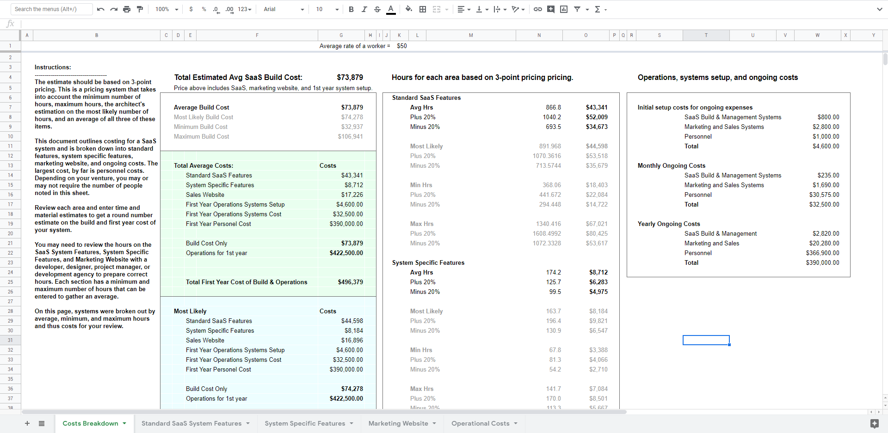
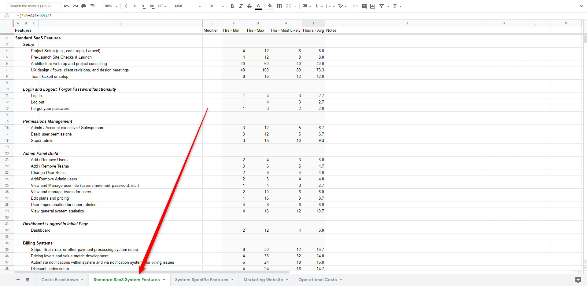
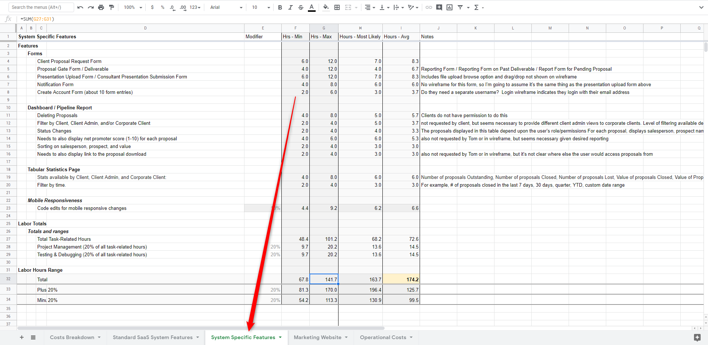
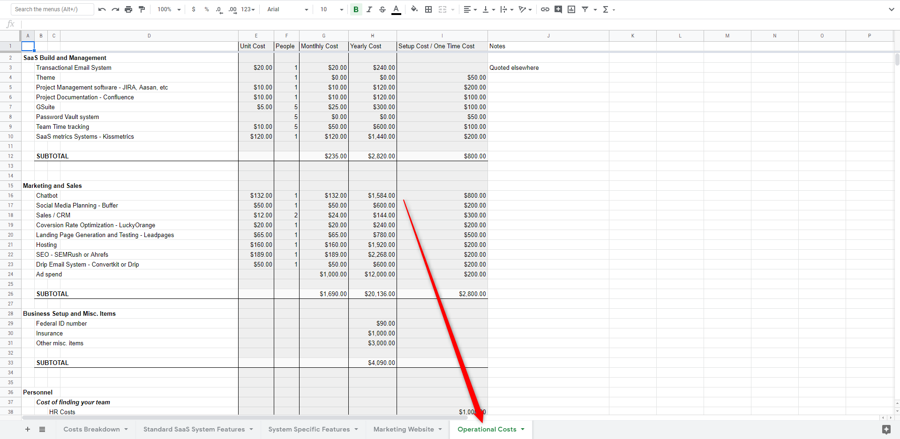
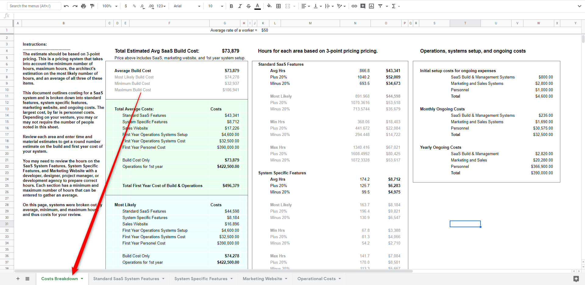

# The Estimate

## Start With Our Estimate Template

This book comes with a template to get you started in your planning process. 

[Get started with the SaaS planning spreadsheet.](https://docs.google.com/spreadsheets/d/1qC2h5e_YFvCAAoWA4Vaj1U7k7XPjsUMuqVoLKLAZh0I/edit?usp=sharing)

_Start off by making a copy of this spreadsheet for your project and putting it into your Google Drive account._

#### Who should work on this?

The following team members should review this document together before proceeding.

* The Information Architect
* Lead Developer
* Lead Designer
* Lead Stakeholder

### Spreadsheet organization

The spreadsheet is broken into five sections:

* Costs Breakdown
* Standard SaaS System Features
* System-Specific Features
* Marketing Website
* Operational Costs

The Costs Breakdown worksheet is a dashboard that shows sums from all other areas in one, centralized place. 

With the exception of the overall costs page, each worksheet has a list of items, modifier column that is used to add a modifying value to the other hours, a minimum, maximum, average, and notes column. 

### Three-Point Cost Estimation

As noted above, this method of price estimation utilizes 3-point cost estimation, a standard Project Management Professional \(PMP\) estimation process. With this process, each item is given three different estimates with which a fourth item is derived. These metrics are:

* Maximum Hours
* Minimum Hours
* Most Likely Hours
* Average Hours - the average of the three items noted above

In development, hours can be vastly different based on small changes to scope of work, so having a range of hours is almost always a necessity in order to set appropriate client expectations. 

Some items in the spreadsheet additionally have a modifier. This is often used to create a calculation. For example, the hours estimate for Project Management is estimated by adding up all labor hours then multiplying that number times a percentage, most often 20%.

## Pricing Standard SaaS Features

Click on the second worksheet in the spreadsheet entitled "Standard SaaS System Features"

The first element of our project estimation focuses on is a listing of “standard features”. In this area, we start off with the general systems that most SaaS systems need. 


**IMPORTANT NOTE:** The item entitled "UX deisgn / flows, client revisions, & design meetings can balloon quickly! This item must be planned by a professional designer. It can easily go from 40 hours to 400 hours, so do NOT underestimate this item!  


Your MVP may or may not require a full list of features often included in a standard SaaS. So review  this worksheet and determine what features can be removed first.

Remember as you proceed through this worksheet that this area covers items that almost all SaaS systems has, but probably none of the system-specific features from your SaaS. That will be covered on the next page.

## System-Specific Features

Now that you have removed anything not necessary from the general SaaS features, move on to the System-Specific Features.

#### Break down the estimate by major features

This worksheet is where you will put the majority of your time for the estimate. In this worksheet, consider the major features, outside of standard SaaS features, that your system contains. Create a header for each major area, then name and describe each major feature. Name the feature or sub-feature under the feature or area title and describe it in the notes column. 

Just as in the Standard SaaS Features worksheet, for each item give a min, max, most likely, and calculate the average.


You will probably need to modify the total, plus 20% and minus 20% cells to calculate the total for the column as you are probably going to increase the number of rows.


## Marketing Website

If you need a marketing website for this project, the marketing website worksheet has a basic set of hours for this project. Technically speaking, a marketing website could be estimated in very much the same fashion as the application. However, in this situation, the marketing website is not heavily broken down. This is a round number estimate on the marketing website, not a deep dive.

Open up the Marketing Website worksheet and have a web-designer start entering estimates based on competitor or benchmark websites for each of the pages you need added to this website. 

The goal here is to get an hours range for each major area, not to have a a complete explanation of every item. However, each item should be at least understood enough so that the person building that system can give an estimate.

## Operational Costs

The operational costs worksheet briefly covers items that most SaaS platforms will want to consider insofar as software systems and people. Since this is just an estimate, a basic review of these numbers is acceptable. 

Not all SaaS systems need every item in the list, but most will need some version or aspect of the system and costs represented here. Go through this worksheet and enter numbers and systems that are required for your system.

## Breaking down the costs


**PROTIP:** My team of experienced information architects, developers, UX designers, & project managers can take as little as four hours and as many as sixty hours to put together an estimate after all the research, conversations with clients, internal discussion, etc. If you've never done this before, plan on spending at least 20 hours doing this aspect of the project. 


Despite having read through this whole document fairly quickly, actually producing a spreadsheet with accurate numbers and clear descriptions can be very time-consuming. 

Now that you have everything worked out, just jump over to the Costs Breakdown worksheet where you can see your final estimates on the project.

#### Now for the most difficult part of the entire process.

The most difficult part of this process is BEING HONEST WITH YOURSELF AND YOUR TEAM ABOUT THE ACTUAL COST. So many entrepreneurs, teams, and especially developers take a look at that final number and say something like "We can just do this for the minimum number of hours." It's a lie that people tell themselves.

Don't lie to yourself. Don't get yourself into trouble. Be honest with yourself and plan for what you're actually going to be spending to build this thing, because that's what it's going to cost.

You can cut things out to take your system down to an MVP, but if you're going to market you need to be prepared or you are going to end up like the countless other SaaS bodies that litter the internet. 

Creating your initial estimate isn't going to be easy. There are a lot of considerations, as the list above should have highlighted. We're going to go a bit more into that now, though.

