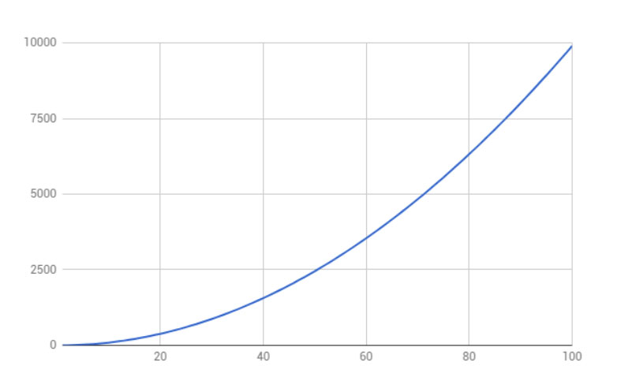

# Development Time Increases As Complexity Increases

## Development Time Increases As Complexity Increases

When you think about it, it makes perfect sense. The problems are that: 1\) most people don’t think about this; and 2\) most people don’t consider by how much complexity increases in projects. These two issues can cause some serious issues in planning and build if they are not considered.

### A quadratic increase in time

Sounds complicated, doesn’t it? It’s not really though. Let’s walk through this:

1. If you have 2 features that send data to and from each other, you have an in and out connection each way. So that is 4 connections of data.
2. If you have 3 features, then you have 12 connections.
3. At 4 features, if all features have to connect to one another, then you are at 24 connections.
4. If we skip 5 and move up to 6, now we are at 60 connections!

Each one of these different connections generally has some kind of graphical or interactive representation, but no matter, they all have to be checked.

Let’s make it simple and say that each item takes 10 minutes to check and there is and issue with one in every 10 items that takes an hour to fix. If you had two features, the system would take you an easy 40 minutes to check and according to our formula, probably no issues to fix. But if we took it to a six feature project, now we are looking at 10 hours to check everything and 60 hours \(you didn’t read that wrong, it is 60!\) to fix the problems, and that is a very simple model!

If, when you are planning the build time of the system, you plan only the build of the features and not an extra level of time for a thorough debugging and review, you are going to underestimate your build, your costs, your time to market, and generally just be very upset.

But now you know, and you won’t make this mistake, right?

