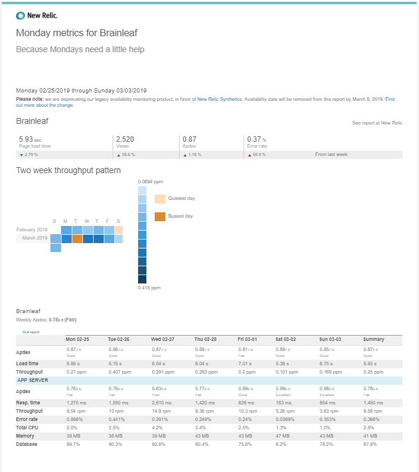

# Monitoring Your SaaS

Now that your SaaS is up and running you’re going to need to look out for issues popping up -- and they will pop up. Implementing a networking monitoring tool will enable you and your development team to know when the site goes down, when the database fails, if you are overtaxing your environment, and in what ways.

## Systems

A couple monitoring systems I have used or team members have used include:

* [New Relic](https://newrelic.com/)
* [App Optics](https://www.appoptics.com/)
* [Traceview](https://traceview.solarwinds.com/)

This will help you in two major ways, understand costs and being alerted to problems. If the site goes down or exceeds certain limits, you’ll get an automated alert and can check in with developers. As the system begins to grow, you’ll be able to see what aspects of the serving environment need to be upgraded. If you are on an environment like [Amazon Web Services \(AWS\)](https://aws.amazon.com/) or [Digital Ocean](https://www.digitalocean.com/), you or a developer will be able to log in and upgrade your server specs before users starts seeing degradation of operations or the systems fails altogether.

My team normally uses Digital Ocean, and from here we setup our monitoring. Each one of the items below will send an email and a notice to our Slack dev channel notifying the team of issues.

### Digital Ocean Monitoring

### New Relic Email

