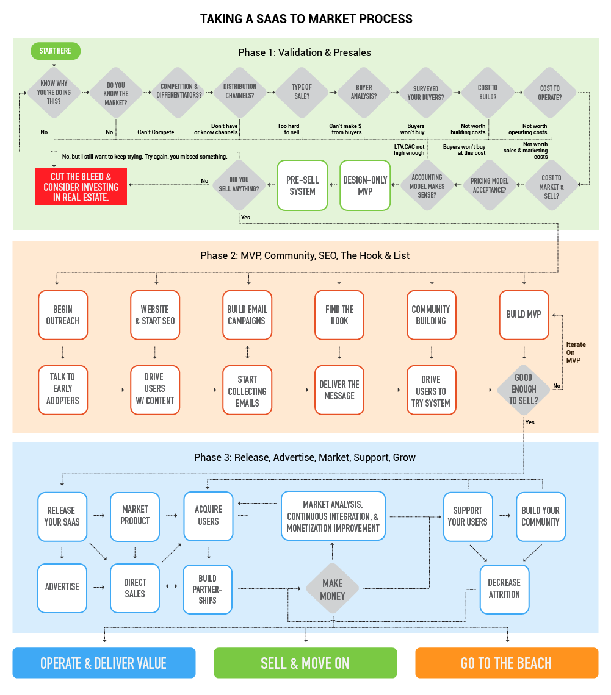

# The Process

## Knowing The Path Is A Step In The Right Direction

It's hard to get somewhere if you don't know where you're going, and most SaaS entrepreneurs I know start off for the first many years fumbling blindly through the forest. Some succeed despite themselves, others have assistance from people who have walked or been guided down this path before, but most fail. 

So let me show you your path and outline the skills you'll need to walk that path. 

## Standard SaaS Process steps:

Step by step, the process of developing your SaaS intertwines almost all aspects of business building, software development, customer acquisition and activation, and the aspects of minimizing attrition. 

You will need to know your path and how everything fits together. So in this section, I have outlined your process from start to finish and explained the principles of each area so you know where to start and where to go as you progress through the rest of the chapters.

## Phase 1: Business Validation & Presales

Validating your business is **THE MOST IMPORTANT THING** you can do. It's so important that this book has an [entire chapter on product validation](../validating-you-saas/validating-your-saas.md). 

If you don't validate your idea, then your chance of success is absolutely minimal. I don't mean one in ten, I mean that you have more like one in one thousand or less chance of being successful. But if you have a good idea and get started building it without testing, you're probably just throwing your money away. Be sure not to skip the [Validation chapter](../validating-you-saas/validating-your-saas.md)!

When validating your business, you need to ask yourself questions including:

* Why are you doing this?
* Do you know the market?
* Do you understand the competition?
* What will differentiate your business from the competition?
* Do you have existing distribution channels? If not, do you know how to get them?
* What kind of sale is this? Is it a marketing-based sale or a direct sale or some mix of the two?
* Do you have quantified personas for your buyers? In other words, do you know how your target markets are segmented, how much each is worth, and what messaging should be used to target each market segment?
* Have you surveyed your buyers to make sure you understand them and that they are willing to make a purchase at your price?
* What is the cost to build and operate?
* What is the cost to market and sell?
* Is your full pricing model accepted?
* Does your accounting model make sense? As in, are you going to be able to grow fast enough and well enough to make this work?

It may sound like a lot of questions and a lot of work, but it's a lot easier to answer a few questions than explain to yourself, your investors, or your partner or spouse what happened to all their money. 

### Phase 2: MVP, Community, SEO, The Hook & List

Once you have validated the product, then it's time to get started marketing it. 

"Wait a minute... don't we have to build the thing first?" you may be asking.

No. A SaaS business is a sales and marketing business. You need to start marketing first for a number of reasons. 

1. It's going to take a lot of time for your website to start ranking, so if you're planning on people finding you to make a purchase, you need to get that website and some content live as soon as possible.
2. You need to know what people respond to best, and it's going to take some serious time to figure that out.
3. Communities don't just spring up out of nowhere, someone has to build them. If you're going to get great feedback, you need to know where to go to get the people and start collecting them.
4. How are you going to email all your raving fans if you have no emails? Where are you going to get these emails? If you think you can just buy them and that's going to work, think again. You have to gain trust, and that takes time.
5. Your first idea isn't going to be perfect, so get ready to talk to a ton of people to figure out the best ways to do things. What people you ask? Well, now you see why you need to start marketing right away.

1. Launch your website
2. [Begin SEO](../acquisition-gaining-saas-users/organic-search-marketing/)
3. Find the hook
4. [Start community building](../attrition-supporting-your-community-and-growing-your-business/saas-community-building.md)
5. [Start gathering emails](../acquisition-gaining-saas-users/email-marketing.md)
6. [Build your system](../saas-build-process/saas-build-process.md) & [beta testing](../saas-build-process/steps-to-developing-a-saas/beta-testing.md)
7. [Iterate & ideate on community suggestions](../saas-build-process/things-to-know-and-expect/development-is-iterative.md)

### Phase 3: Release, Advertise, Marketing, Support, & Grow

1. Release your SaaS
   1. May want to consider a [Lifetime Deal](../acquisition-gaining-saas-users/lifetime-deals.md)
2. PR + [Advertising](../acquisition-gaining-saas-users/pay-per-click-ppc.md)
3. Grow your SaaS
   1. Podcasts - sponsoring and getting on the circuit
   2. Education
   3. [Blog / SEO](../acquisition-gaining-saas-users/organic-search-marketing/)
4. Comparison sites
5. [Channel Partners](../acquisition-gaining-saas-users/affiliates-and-partnerships-for-saas-businesses.md)
   1. [Affiliate Marketing](../acquisition-gaining-saas-users/affiliates-and-partnerships-for-saas-businesses.md)
   2. Influencers
6. Outbound marketing
7. Support your customers
8. Grow your business and make money

### Phase 4: Scale & Grow

1. Grow user base
2. Increase team size
3. Grow market share
4. Scale your company

### Every business is different.

Every business is different, and things change a lot depending your system, your customers, and much, much more. But the process noted above is what I have seen more often than anything else. Most of the steps will be followed one way or another anyway. 

