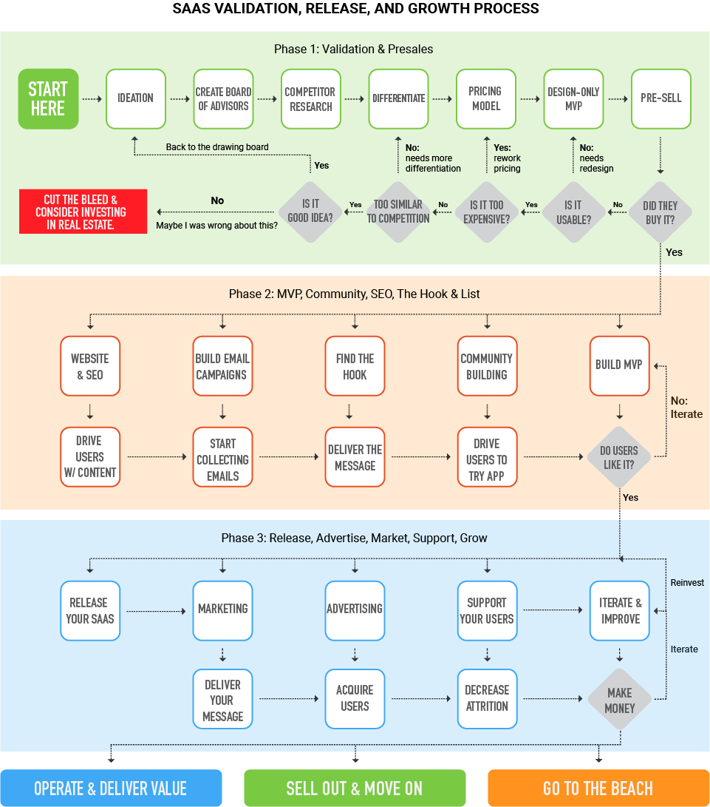

# The Process

## Where to start?

A lot of people get started with an idea, skip the validation, hire a team, and get going on the build of their project. Then, they get to the sales part and don't have a plan in place. They quickly find out that just because you built it, they will not come. 

### Here's what I see a lot:

1. I have an idea!
2. Hire a team to build my idea.
3. How do I sell this thing?
4. Throw money at marketing something that never had a chance in the first place.
5. Give up and complain about how the developers destroyed a great idea.

As you probably suspected, there's a much better way. 

## Standard or Enterprise

The first thing to note though is that your overall process is dependent on what you're selling and to whom. If you're selling what I would call a 'Standard SaaS', meaning a SaaS that is marketed to you target audience primarily through the web, affiliate marketing, or other further reaching marketing methods and sells for what starts out as a fairly small amount of money on a monthly basis. This amount can grow tremendously based on your value metric for the right customer, but most users are going to spend somewhere between $10 and $1000 per month on your project.

Then there's the Enterprise SaaS. This is a SaaS that is sold first at the enterprise level, then maybe at a smaller scale. It is what is known as an Enterprise Sale. Most enterprise sales have a much longer sales cycle, as well as a much higher price. Enterprise sales come with their own set of problems but very often a hefty price tag. A friend of mine sells his Enterprise SaaS to some of the worlds largest consulting companies for what amounts to $200,000 per year per business, and they are happy to pay him. 

A lot of SaaS businesses sell both standard and enterprise, but when you're launching, you need to know the difference because it is very difficult to do both sales at the same time. Thus this launch and sales difference affects your overall process. 

## Standard SaaS Process steps:

1. Phase 1: Validation & Presales
   1. Ideation
   2. [Create a board of advisers](validating-your-idea.md#step-2-reach-out-to-your-personal-network-of-people-and-find-a-group-of-advisers-who-work-in-this-industry-or-are-your-target-market-convince-them-to-be-on-your-board)
   3. [Comprehensive competitor research](validating-your-idea.md#step-3-make-a-list-of-competitors-and-sign-up-for-their-systems)
   4. [Differentiation](validating-your-idea.md#step-4-now-that-you-know-your-competitors-figure-out-how-youre-different)
   5. [Price model creation](../appraisement-pricing-your-saas/appraisement-saas-pricing.md)
   6. [Design-only MVP](../saas-build-process/your-saas-mvp-pre-development-build-checklist.md)
   7. [Pre-sell and complete your validation](validating-your-idea.md#step-7-get-your-advisory-group-into-a-room-physical-or-virtual-and-ask-them-all-if-your-solution-is-going-to-solve-their-problems-and-if-the-cost-is-worth-it-if-the-answer-is-yes-ask-them-to-buy-it-during-the-meeting)
2. Phase 2: MVP, Community, SEO, The Hook & List
   1. Launch your website
   2. [Begin SEO](../acquisition-gaining-saas-users/organic-search-marketing/)
   3. Find the hook
   4. [Start community building](../attrition-supporting-your-community-and-growing-your-business/saas-community-building.md)
   5. [Start gathering emails](../acquisition-gaining-saas-users/email-marketing.md)
   6. [Build your system](../saas-build-process/saas-build-process.md) & [beta testing](../saas-build-process/steps-to-developing-a-saas/beta-testing.md)
   7. [Iterate & ideate on community suggestions](../saas-build-process/things-to-know-and-expect/development-is-iterative.md)
3. Phase 3: Release, Advertise, Marketing, Support, & Grow
   1. Release your SaaS
      1. May want to consider a [Lifetime Deal](../acquisition-gaining-saas-users/lifetime-deals.md)
   2. PR + [Advertising](../acquisition-gaining-saas-users/pay-per-click-ppc.md)
   3. Grow through teaching
      1. Podcasts - sponsoring and getting on the circuit
      2. Education
      3. [More Blog / SEO](../acquisition-gaining-saas-users/organic-search-marketing/)
      4. Medium
   4. Comparison sites
   5. [Channel Partners](../acquisition-gaining-saas-users/affiliates-and-partnerships-for-saas-businesses.md)
      1. [Affiliate Marketing](../acquisition-gaining-saas-users/affiliates-and-partnerships-for-saas-businesses.md)
   6. Outbound marketing
   7. Support your customers
   8. Grow your business and make money

### Every business is different.

Every business is different, and things change a lot depending your system, your customers, and much, much more. But the process noted above is what I have seen more often than anything else. Most of the steps will be followed one way or another anyway. 

