# Competition Analysis

If you think you’re the first person to come up with this idea, you’re probably wrong. In fact, you’re almost definitely wrong. Maybe no one else has taken this idea to market, if you’re building something truly unique, but I doubt it. You probably just haven’t looked hard enough. 

In this section, we are going step by step through all the tricks to:

1. Find your competition
2. Understand their features
3. Understand their buyers
4. Understand their pricing
5. Know if you can compete with them

This step will help you realize if this project is worth it, if you can be successful, and maybe even realize if there is a market before you even start. If you competitors aren’t doing something or doing it in some particular way, there’s probably a reason, and for the most part, it’s not that they’re uninformed. So if you think you have a great new idea that no one is doing, it's important to remember that there may be a reason for that.

Knowing your competition also means knowing your competitors buyers and buyer groups. This helps you find holes in the market and understand ways to reach out to people that are not being served, or serve them in a different way. We’re going to take a much deeper look at your buyers in the next section, and this initial competitor research will give us a great start there. So be sure to keep your notes on buyers from this chapter, we’re going to be using them next!

## Finding Your Competition

In this section we are going walk through the steps to finding your competition. You have two major types of competitors, direct competitors and indirect competitors. Direct competitors are competitors that are doing very close to or the same thing you are doing and are competing for the same buyers and thus the same dollars as you. Whereas indirect competitors are companies or tools that do something similar or are used to accomplish the same tasks. 

For example, an indirect competitor for Slack might be Google Hangouts or Skype. It allows people to talk to chat with one another online. Since Hangouts and Skype are both free, buyers aren't paying to use those tools, but they have the option at any time. Just the option to use something, especially for free, is a big pull from a paid system. So whatever that is for you, it is also your indirect competitor. 

Start by opening the competition spreadsheet and entering the competitors you know. If your answer is that you don't have any competitors, you're probably not looking hard enough. If you're not knee deep in an industry to start you may not know where to look. 

This was my process recently for trying to validate a lead generation system for a particular industry. When I first did a search, I didn't find much. So I got all excited that maybe I was the first person to ever think about scraping the web and cross-referencing information to find leads. Not smart, I know. Here was my process for learning how truly wrong I was. 

### Step 1: Search Google

As any enterprising person would do, the first step I took was to search Google. The search term I used was "lead generation system." That seems like something that would work, right? Well, it doesn't really. Google, and most other search engines have this problem with people trying to figure out how they work and tricking the system. This pushes up a bunch of articles that are built to rank, but don't actually have any particularly useful information on them. Coincidentally,  bit later in the book we're going to delve into the specifics of how to do this as well. So if you're good, you too can waste people's time as they're trying to validate their product as well! 

So your first few pages may not have exactly what you're looking for. This is what they look like at the moment:

Mostly ads, a definition, and a bunch of pages that lead you nowhere useful. So let's move on to the next page:

Huh... not much more here. Maybe my idea for a lead generation system is looking better! Or maybe lead generation companies just haven't figured out the SEO game yet? Either way, it's looking exciting from my 2-page search so far. 

So let's take it a step further and clarify our search terms some. This time we're going to use the search term "lead generation system for web developers". I scrolled past the ads and now it's looking even more exciting. Really, not a single SaaS system that creates leads for web-developers. I guess this is my lucky day!

Three whole searches and I've only see the one ad for Cognism from the first search. When we take a look at the site, there's no on-page pricing, which means it's expensive. It also means that it's going to be on my list of companies to trial. But so what? Right now it looks like just Cognism and I are sitting on a gold mine, minus the buck fifty they paid when I clicked on their ad.

### Step 2: Social Media Requests

Social media goes next because it can take a few days to get responses back from people. If you're entering a crowded market, you may want to consider skipping ahead. But if you think you're going to need to ask the audience, start here and then go on.

#### Ask Facebook

I need to ask some people who really know their stuff, so how about other SaaS entrepreneurs? It's their business, so they probably know. 

My first stop, my good friend Sampath's group, [SaaS Mantra](https://www.facebook.com/groups/saasmantra/). Here was my post:

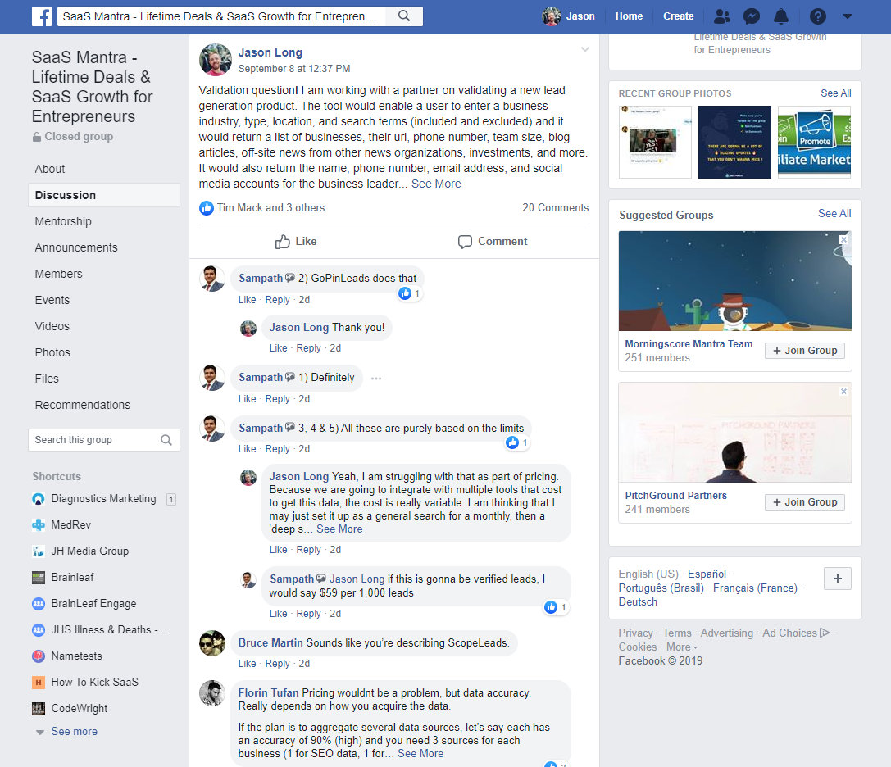

From this first post I did on a SaaS owners Facebook group, I got some super valuable, and bubble bursting, feedback. First, there are tons of companies doing this. Second, it's really, really hard and takes a lot of work. 

But at least now I have a list of competitors. Here's what I found from this post:

* GoPinLeads
* ScopeLeads
* Crunchbase - should have thought about that one up front.
* Clearbit
* Zoominfo
* Apollo
* Leadgenius
* Mattermark
* Zirra
* Predict Leads
* Findthatlead
* Leadcandy
* Soleadify

Probably the most valuable thing I found from this post was that I had a connection in the industry who had already been a part of a build team doing exactly this work who was willing to chat with me for an hour. That was probably the most valuable conversation I could have had since he was kind enough to tell me exactly how to do the project. The catch here as he put is "This stuff is really, really complicated and you're going to need a 4 or 8 man team working for a year to do what you want to do, and you still may not be able to get it all figured out." So he told me how wrong I was about my first assumptions about the project, the industry, and how long it was going to take to get it all done. 

At the same time as posting that first post, I had also posted into the SaaS Growth Hacks Facebook group.

I didn't get as much here, but I did realize that I forgot to add to my indirect competitors list a few items:

* Snov
* Sales Navigator
* Ahrefs
* SEMRush

It also told me that either people don't care and won't answer in this group or that there is a general lack of knowledge about what is going on in the industry. Useful, but I already had what I was looking for from the other group. However, a few days after the post, I got another message from a contact from this group that informed me that there are literally hundreds of companies doing this exact same thing and that it is a really difficult thing to do, exactly like the last guys said. 

#### Ask LinkedIn

Next up, ask the pros at LinkedIn. I went ahead and posted the same question, but with a new image on LinkedIn. From this post, I got a few answers, but nothing really helpful. LinkedIn recently has been a lot about viral videos and a lot less about real questions and answers. But if you have a knowledgeable network, it could still be helpful.

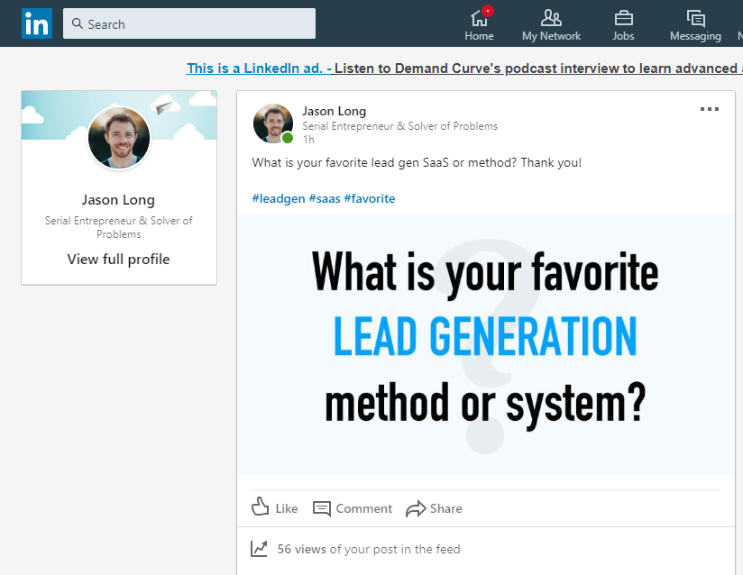

### Step 4: Seach ProductHunt.com

If you're looking for a SaaS application or app, Producthunt.com is the spot to go. There are thousands of systems there there can be easily searched. Start off with just a basic search:

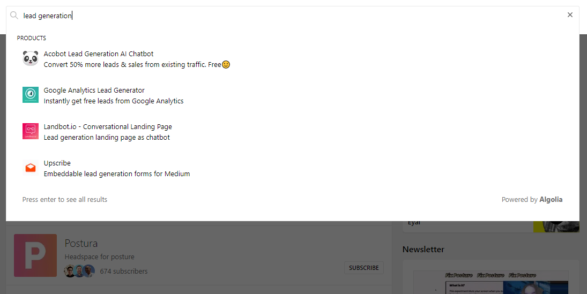

You'll probably find what you're looking for right in the search console, but if not start scrolling through the results.

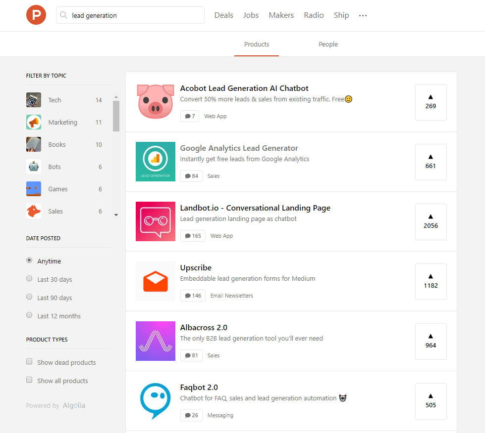

If that doesn't work, then take it up a notch and post onto the makers discussion board. I would probably ask if anyone knows about your particular niche and try to find keywords or phrases that you're not familiar with to search for. From there, you can start again here, go back to Google, go back to Facebook, or move onto the next step.

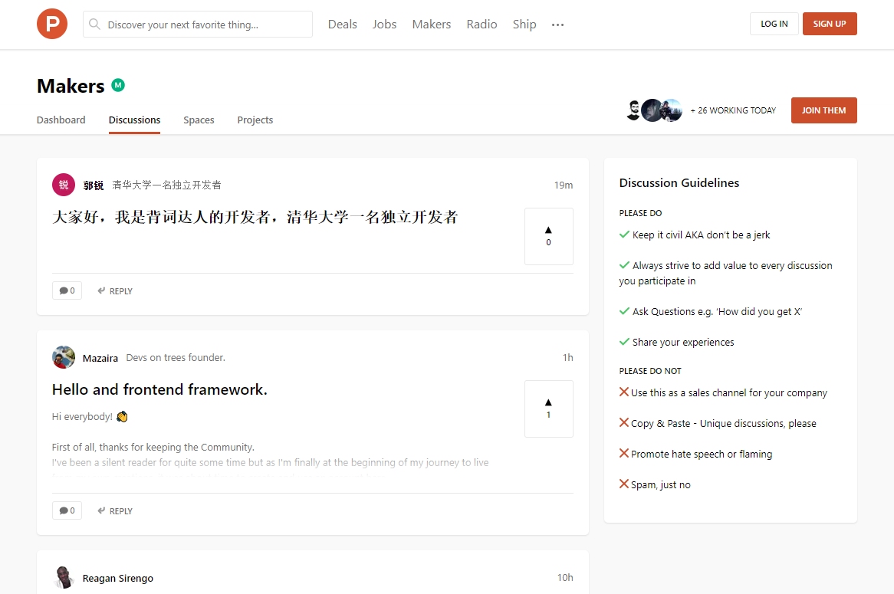

### Step 5: Search review sites and similar websites

Now that we've got some insight and a list of competitors, let's do another search. This time though, let's not search Google, let's search a few review & comparison websites:

#### G2:

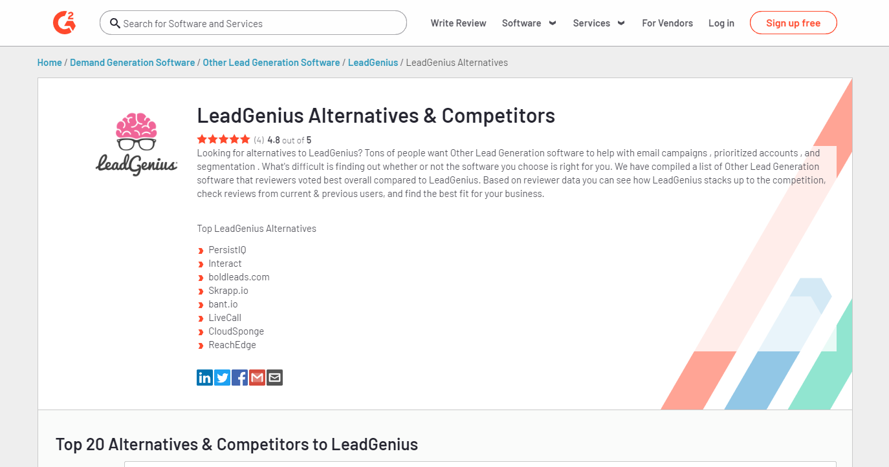

#### Owler:

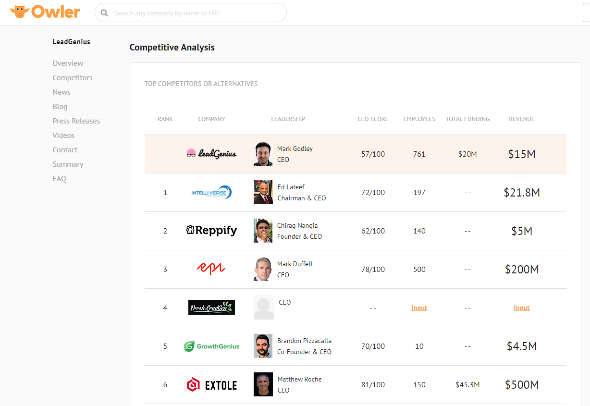

#### SimilarWeb

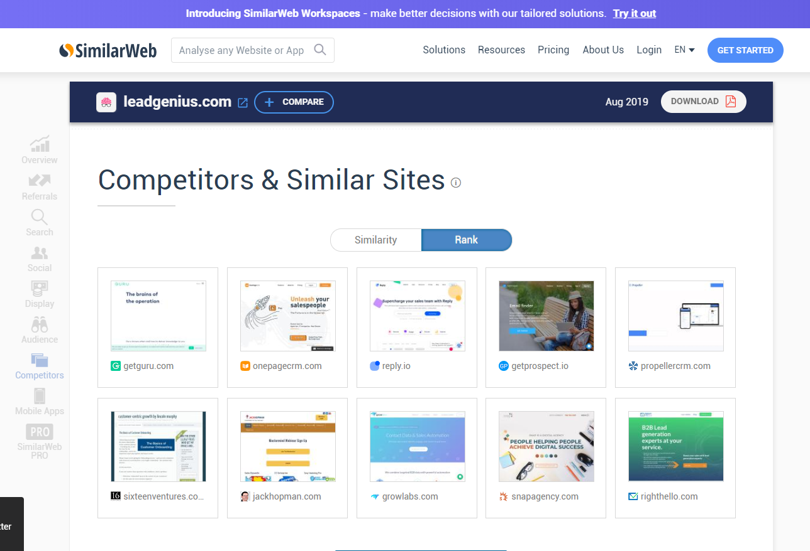

### Step 6: Check with SEO tools

If you still don't have what you're looking for with your search engine, social, and review/similar site searches, then it's time to open up some tools to do the search. My favorite for this is Ahrefs.com. Sign up for the $7 trial, enter one competitor and search for their competing websites.

From here, you can see the websites that they are competing with. Most of the time, this list will give you insight into where else to look and what else to look for.

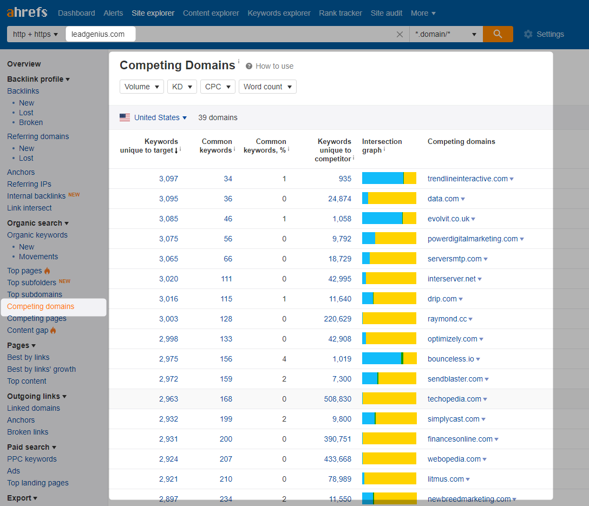

The view here just has some top level items, but you can use this as a start to dig in and find even more competitors. 

### The Competitors List

Our list is pretty extensive now, and it just keeps getting bigger now that we know what to search for and where to look. 

Here are our contenders:

* GoPinLeads.com
* ScopeLeads.io
* Crunchbase.com
* Clearbit.com
* Zoominfo.com
* Apollo.io
* Leadgenius.com
* Mattermark.com
* Zirra.com
* PredictLeads.com
* Findthatlead.com
* Leadcandy.com
* Soleadify.com
* GetProspect.io
* RightHello.com
* Growlabs.com
* Inbox25.com
* Bant.io
* DefinitiveHQ

As you can see, there are a ton more in this than what we found in our first searches. It's also looking like that conversation with the developer who said that there are hundreds of competitors is proving to be true. 

This is the point where I put the brakes on the project and decided that I did not in-fact want to pursue this project. But let's say that this list wasn't overwhelming or I thought that my system could compete against these players.  Then it would be time to move on to...

## No Competition?

It's not impossible that there is no competition, but it is fairly unlikely. The things to know if you can't find any competition are that:

1. It may not be a viable market
2. They already went out of business
3. There is a monopoly 
4. There is already a solution that does not require a SaaS
5. Maybe you just stumbled onto a good idea that no one has come up with yet? Probably not though. It's not impossible, it happens every day. But it happens less and less every day. 

### You probably haven't looked hard enough

In the example above, I was able to pull from a group where I had great connections already and people know me. But in two out of three areas I didn't get much back. So my recommendation is to take the process I noted above and keep at it until you find your competitors. Google may not have all the answers, but just finding a few and then using G2 and sites like similarweb 

### It may not be a viable market

If no one is already doing this, then there is a good chance that it's not worth doing. It could be that the indirect competitors are too strong or robust to deal with, the market size is too small or unreachable, or that they just don't have much money to spend. Either way, it's important to remember that if no one else is doing this, that there is more than likely a good reason for that.

### There is a monopoly

Especially if you're competing in a regulated industry like healthcare, you have to watch out for monopolies. Groups with monopolies don't want everyone to know they have a monopoly, so sometimes you'll take a look at an industry that seems overripe for competition, but on a deeper look you'll realize that it's impossible to compete. For example, one of my companies was interested in competing with Health Grades for certain Centers for Medicare & Medicade Services data. It turns out there is a congress-mandated order that gives Health Grades a monopoly there. Unless you have some pretty high up friends, that one is untouchable. 

### You stumbled onto a great idea with no competition

The odds are low, but improbably things happen all the time. If you've done all your homework, talked to all the right people, searched and searched and search, and still haven't found any competition, then maybe you're on to something new. It could also be that you're applying a known system to a new industry or niche, which does happen all the time with a good probability of success. 

If this is the case, then fantastic! But you still have to do the rest of the validation process. Just because there aren't any competitors to be found doesn't mean that people will buy the thing. In fact, it makes your validation process a bit harder because you don't have anything to compare this idea to. 

## Competitor Feature & Buyer Analysis

Before we look at competitors, let's take a look inward first. You probably already know a bit about what major features you want to provide, how you want to provide them, and to who. So start off by [opening up this spreadsheet](https://docs.google.com/spreadsheets/d/11J-HBYVhaOXyrQpR3S7fTP8JMNhjvS9IYOlVUTVhBDw/edit?usp=sharing),  making a copy and listing your company first. The spreadsheet has four worksheets. These are Competitors, Buyers, Competitor Features, Buyer Feature Interest, and setup. 

### Competitors Worksheet

Start by opening the Competitors worksheet and entering your business at the top, then your competitors.

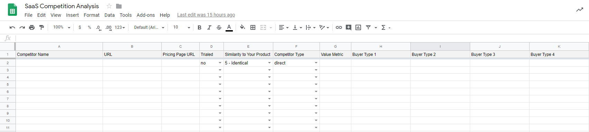

If you can't see the spreadsheet, the competitor worksheet fields are:

* Business or Competitor name
* URL
* Pricing page URL
* Trialed - have you taken a trial of their system yet
* Similarity to your product - 1 - 5 scale
* Competitor type - direct or indirect
* Value Metric
* Buyer type 1 - general demographic information
* Buyer type 2
* Buyer type 3
* Add more buyer types as needed
* Major feature 1
* Major feature 2
* Major feature 3
* Add more major features as needed

For each business, start filling in the fields. It's not necessary to get every single competitor listed, especially if they're really not a competitor. But I recommend getting as many as you can. 

### Demo Competitors Systems

Once you have each competitor necessary listed, then it's time for the time-consuming task of testing out each of their systems. If they have a freemium version, go trial their system. If not, then request a demo let them walk you through it.

As you go through each competitor's system, be sure to dig for as much information as you can. After the sales-person gets into the system, the following questions are great ways to learn more about the company, their success, and their customers:

* How long have you been with this company?
* What do you think is the best feature in the system?
* Where are people having a hard time using the system and why?
* What are some examples of your biggest customers?
* What's the difference between you and \[choose a competitor\]?
* What's on your development roadmap? OR What features do you have upcoming?
* How did the business get started?
* How did you guys get your first customers?
* Where do most of your customers come from?
* Which feature is the most used?

I like to really dig into questions about the specifics of customer demographics, features, usage, and customer support. Sales people love talking about their company, so ask open ended questions and let them talk. Also, you may find that the person you're talking to knows a little bit about how the system is developed. Make sure to ask a bit about that as well, you never know what valuable tidbits of information you'll find!


Make sure to record the audio and screens during your recordings! You will really need this later. If you can't get recordings, take screenshots and have someone else watch and take notes as you do the demo.


Make sure you take note of every major feature for each competitor during or shortly after the demo. You're going to need to remember these features for the next step, and you're especially going to want to remember how the UX is organized if your system passes validation and gets into the design phase.

### Features, Plans, & Pricing

Now that you have a list of your top competitors and have looked over all of their features, you should know which companies are your primary competitors, if they have similar features, what systems you will and will not compete with them on, and if you really do have a unique selling proposition. 

Now, take the top three to five and line them up side in the competitor features worksheet.

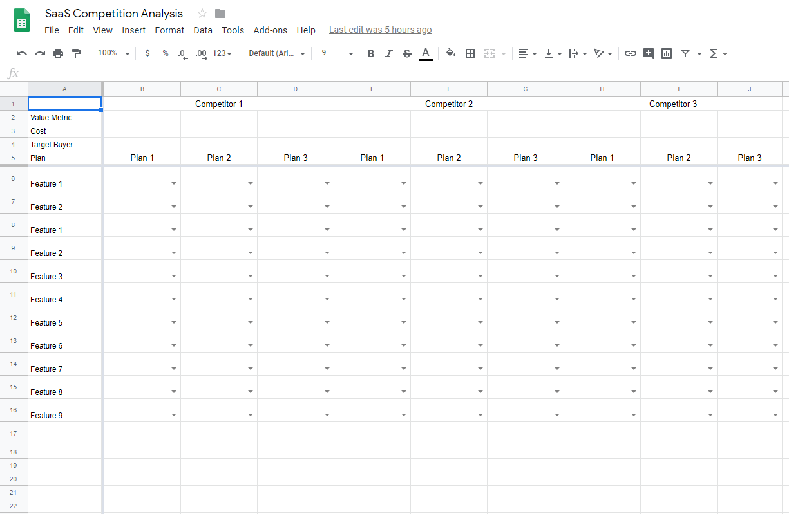

Start off by naming each competitor at the top, then for each plan enter their:

* Value Metric
* Plans per competitor
* Cost
* Target buyer per plan
* Features available for each plan
* Highlighted features for each plan shown in your competitors pricing pages - these are generally the features at the top of the page that each user group is most interested in.

For example, here is a the pricing page for Mattermark, not the highlighted areas:

And here is ZoomInfo:

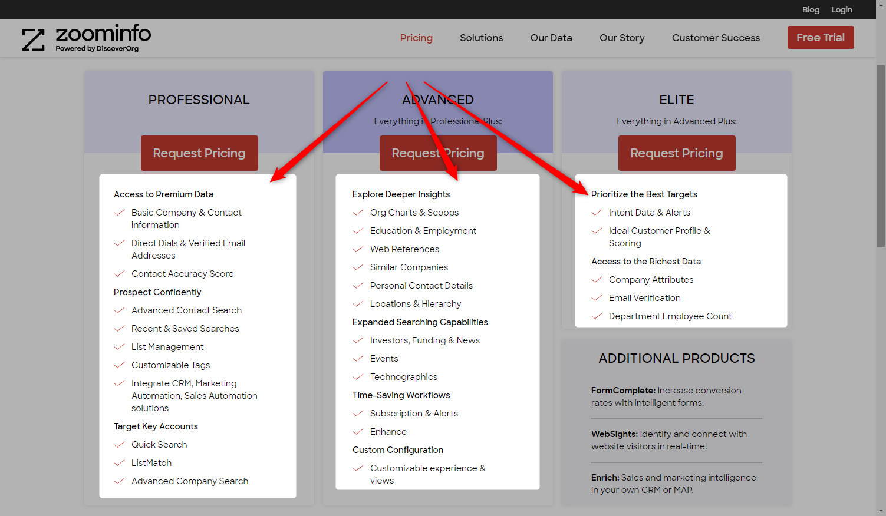

These highlighted features are generally the features that are most important to each user group. Not only do these items give you insight on how to price your SaaS, they also show you what these companies have figured out that their customers value most. Please take a look at the [Appraisement chapter in this book for more on pricing](../../appraisement-pricing-your-saas/appraisement-saas-pricing.md).

Now that you have your top competitors lined up, their general buyer groups worked out, and your competitors features examined, you can now really start asking yourself the following things:

1. Do I have a unique selling proposition?
2. Can I produce a competitive advantage?
3. Is there a hole in the market?
4. Could I twist this product to enter the market in a new way to be competitive?
5. Do I need to produce the same features as my competition to be competitive?


Just about all SaaS businesses have great margins, so if your competitive advantage is price, your competitors who are already in the market can probably change their prices to match yours. Be careful about listing price as a competitive advantage in SaaS!


Competitors are just one part of the equation though. You must also thoroughly understand your buyers, their markets, and more. Later in the book, in the chapter on [Appraisement](../../appraisement-pricing-your-saas/appraisement-saas-pricing.md), you will need to have a thorough understanding of buyers and competition to competitive price your product. 

