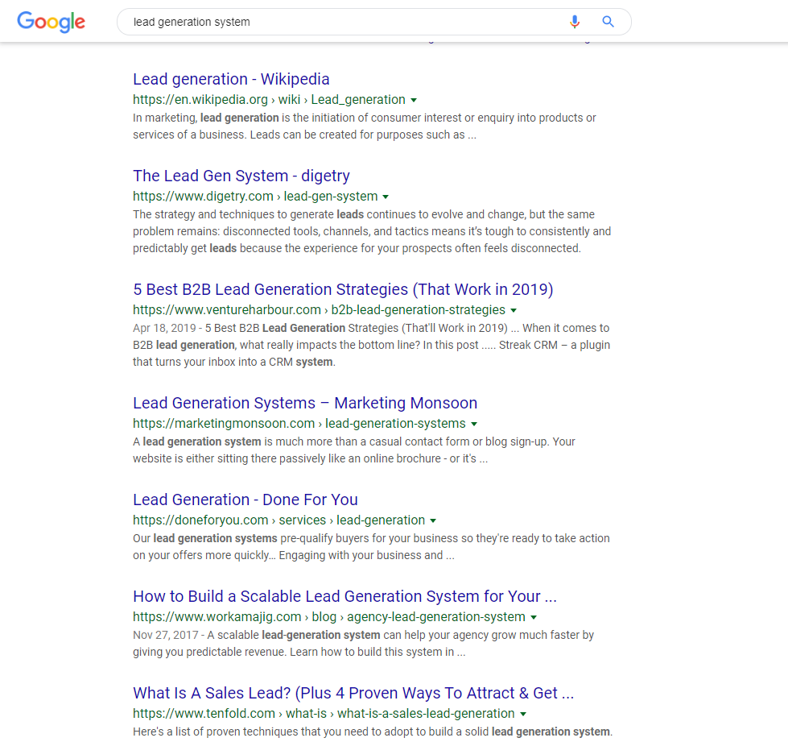
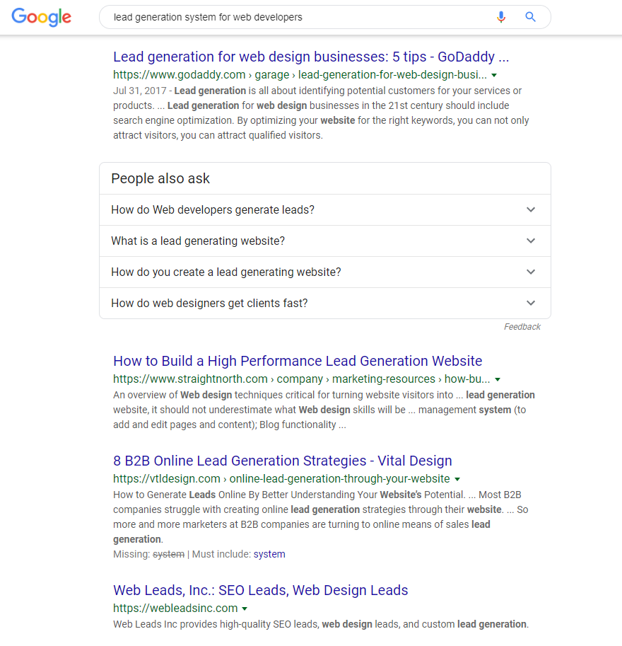

# Competition Analysis

If you think you’re the first person to come up with this idea, you’re probably wrong. In fact, you’re almost definitely wrong. Maybe no one else has taken this idea to market, if you’re building something truly unique, but I doubt it. You probably just haven’t looked hard enough. 

In this section, we are going step by step through all the tricks to:

1. Find your competition
2. Understand their features
3. Understand their buyers
4. Understand their pricing
5. Know if you can compete with them

This step will help you realize if this project is worth it, if you can be successful, and maybe even realize if there is a market before you even start. If you competitors aren’t doing something or doing it in some particular way, there’s probably a reason, and for the most part, it’s not that they’re uninformed. So if you think you have a great new idea that no one is doing, it's important to remember that there may be a reason for that.

Knowing your competition also means knowing your competitors buyers and buyer groups. This helps you find holes in the market and understand ways to reach out to people that are not being served, or serve them in a different way. We’re going to take a much deeper look at your buyers in the next section, and this initial competitor research will give us a great start there. So be sure to keep your notes on buyers from this chapter, we’re going to be using them next!

## Finding Your Competition

In this section we are going walk through the steps to finding your competition. You have two major types of competitors, direct competitors and indirect competitors. Direct competitors are competitors that are doing very close to or the same thing you are doing and are competing for the same buyers and thus the same dollars as you. Whereas indirect competitors are companies or tools that do something similar or are used to accomplish the same tasks. 

For example, an indirect competitor for Slack might be Google Hangouts or Skype. It allows people to talk to chat with one another online. Since Hangouts and Skype are both free, buyers aren't paying to use those tools, but they have the option at any time. Just the option to use something, especially for free, is a big pull from a paid system. So whatever that is for you, it is also your indirect competitor. 

Start by opening the competition spreadsheet and entering the competitors you know. If your answer is that you don't have any competitors, you're probably not looking hard enough. If you're not knee deep in an industry to start you may not know where to look. 

This was my process recently for trying to validate a lead generation system for a particular industry. When I first did a search, I didn't find much. So I got all excited that maybe I was the first person to ever think about scraping the web and cross-referencing information to find leads. Not smart, I know. Here was my process for learning how truly wrong I was. 

### Step 1: Search Google

As any enterprising person would do, the first step I took was to search Google. The search term I used was "lead generation system." That seems like something that would work, right? Well, it doesn't really. Google, and most other search engines have this problem with people trying to figure out how they work and tricking the system. This pushes up a bunch of articles that are built to rank, but don't actually have any particularly useful information on them. Coincidentally,  bit later in the book we're going to delve into the specifics of how to do this as well. So if you're good, you too can waste people's time as they're trying to validate their product as well! 

So your first few pages may not have exactly what you're looking for. This is what they look like at the moment:

Mostly ads, a definition, and a bunch of pages that lead you nowhere useful. So let's move on to the next page:

Huh... not much more here. Maybe my idea for a lead generation system is looking better! Or maybe lead generation companies just haven't figured out the SEO game yet? Either way, it's looking exciting from my 2-page search so far. 

So let's take it a step further and clarify our search terms some. This time we're going to use the search term "lead generation system for web developers". I scrolled past the ads and now it's looking even more exciting. Really, not a single SaaS system that creates leads for web-developers. I guess this is my lucky day!

Three whole searches and I've only see the one ad for Cognism from the first search. When we take a look at the site, there's no on-page pricing, which means it's expensive. It also means that it's going to be on my list of companies to trial. But so what? Right now it looks like just Cognism and I are sitting on a gold mine, minus the buck fifty they paid when I clicked on their ad.

### Step 2: Ask Facebook

I need to ask some people who really know their stuff, so how about other SaaS entrepreneurs? Turns out, they really do know their stuff. 

My first stop, my good friend Sampath's group, SaaS Mantra. Here was my post:

From this first post I did on a SaaS owners Facebook group, I got some super valuable, and bubble bursting, feedback. First, there are tons of companies doing this. Second, it's really, really hard and takes a lot of work. 

But at least now I have a list of competitors. Here's what I found from this post:

* GoPinLeads
* ScopeLeads
* Crunchbase - should have thought about that one up front.
* Clearbit
* Zoominfo
* Apollo
* Leadgenius
* Mattermark
* Zirra
* Predict Leads
* Findthatlead
* Leadcandy

Probably the most valuable thing I found from this post was that I had a connection in the industry who had already been a part of a build team doing exactly this work who was willing to chat with me for an hour. That was probably the most valuable conversation I could have had since he was kind enough to tell me exactly how to do the project. The catch here as he put is "This stuff is really, really complicated and you're going to need a 4 or 8 man team working for a year to do what you want to do, and you still may not be able to get it all figured out." So he told me how wrong I was about my first assumptions about the project, the industry, and how long it was going to take to get it all done. 

At the same time as posting that first post, I had also posted into the SaaS Growth Hacks Facebook group.

I didn't get as much here, but I did realize that I forgot to add to my indirect competitors list a few items:

* Snov
* Sales Navigator
* Ahrefs
* SEMRush

It also told me that either people don't care and won't answer in this group or that there is a general lack of knowledge about what is going on in the industry. Useful, but I already had what I was looking for from the other group. However, a few days after the post, I got another message from a contact from this group that informed me that there are literally hundreds of companies doing this exact same thing and that it is a really difficult thing to do, exactly like the last guys said. 

You can also just add them here:

<table>
  <thead>
    <tr>
      <th style="text-align:left">Competitor</th>
      <th style="text-align:left">Major Features</th>
      <th style="text-align:left">Feature Overlap</th>
      <th style="text-align:left">Pricing Page Link</th>
      <th style="text-align:left">
        
Trial Taken

        
Yes / No

      </th>
    </tr>
  </thead>
  <tbody>
    <tr>
      <td style="text-align:left"></td>
      <td style="text-align:left"></td>
      <td style="text-align:left"></td>
      <td style="text-align:left"></td>
      <td style="text-align:left"></td>
    </tr>
    <tr>
      <td style="text-align:left"></td>
      <td style="text-align:left"></td>
      <td style="text-align:left"></td>
      <td style="text-align:left"></td>
      <td style="text-align:left"></td>
    </tr>
    <tr>
      <td style="text-align:left"></td>
      <td style="text-align:left"></td>
      <td style="text-align:left"></td>
      <td style="text-align:left"></td>
      <td style="text-align:left"></td>
    </tr>
  </tbody>
</table>

* Have you thoroughly researched your competition?
  1. Do you have competition?
     1. Yes - List your competitors
        1. Company
        2. List major features
        3. List prices/pricing
        4. What are the groups of people that your competitors are selling to?
        5. Screenshot their pricing pages
        6. Take a trial for each competitor
     2. No
        1. How did your search?
        2. Did you call companies or people with the problem and ask how they solve it now?
        3. Why is there no competition?
           1. Not a viable market
           2. Maybe you just stumbled onto a good idea that no one has come up with yet? Probably not though.
           3. They already went out of business
           4. There is a monopoly 
           5. There is already a solution that does not require a SaaS
     3. What are your indirect competitors?
        1. Competition
        2. What makes it indirect
        3. What percent of the market do they own?

